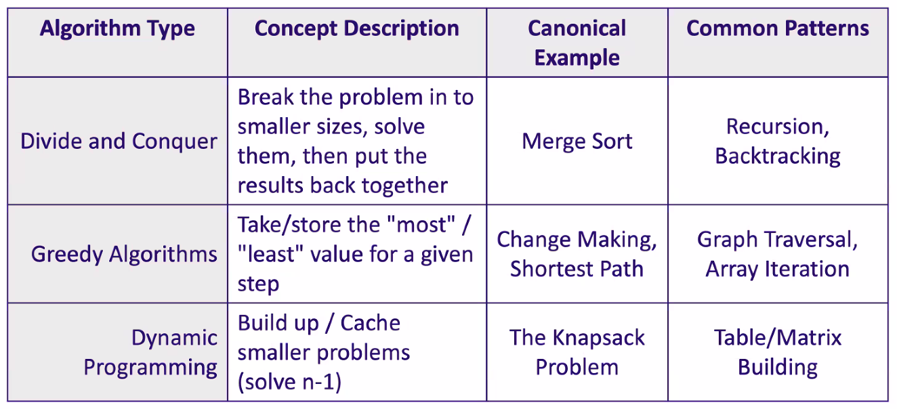
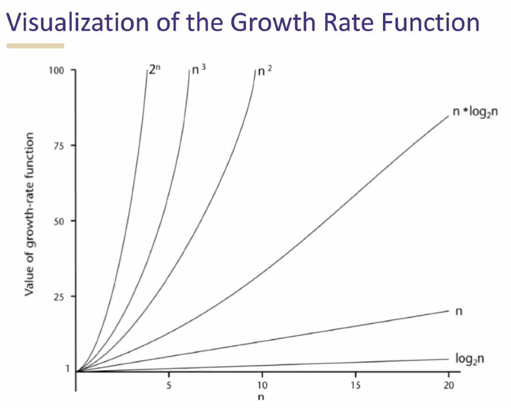
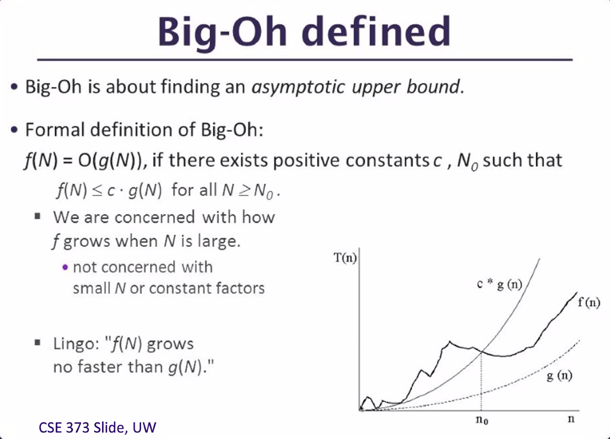
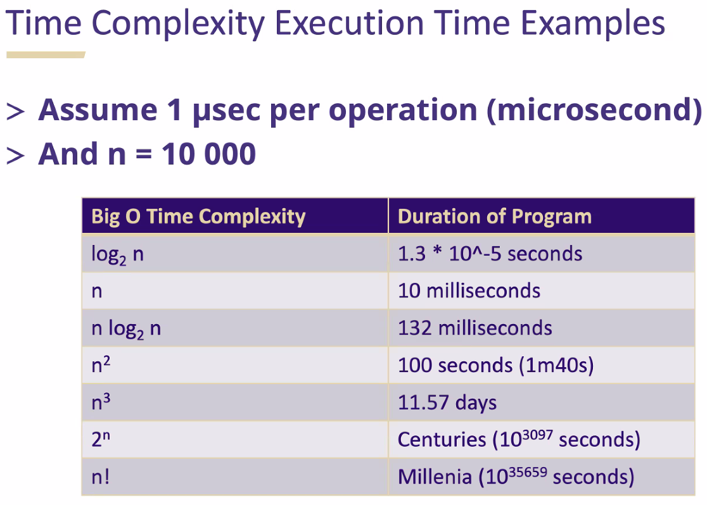

_10/01/22, 9:30a-12:00p_

# TCSS 501

## Resources
- [Class GitHub Repo](https://github.com/k3a-uw/tcss501)

## Algorithms

> "Computers are good at following instructions, not at reading your mind" - Donald Knuth

**Algorithm:** A series of instructions/actions with an intended purpose or goal

- Does NOT have to be deterministic (ex. random number generator)
- Does NOT have to be idempotent (be affected by previous runnings)
- Does NOT have to be terminal 
- Does have to be EXPLICIT

**Why?**
- Learn novel and efficient ways to solve problems
- Know what is computable precisely and what requires estimation
- If you have problem P with an unknown solution and you have problem X with a known solution... your problem P is now to reduce problem P to problem X

### Types of Algorithms

#### Divide and Conquer

Break the problem into smaller sizes

- ex. merge sort
- common patterns: recursion, backtracking

#### Greedy Algorithms

Take/store the most/least value for a given step

- ex. change making, shortest path
- common patterns: graph traversal

#### Dynamic Programming

Build Up/Cache smaller problems (solve n-1)

- ex. The knapsack problem
- common patterns: table/matrix building




____

## Runtime Analysis

How "long" will a program take to run?

- Java vs Python vs C++ vs C
- To make independent we look at input size: N

Desire is to use mathematics to allow us to compare different answers to the same problem agnostic to tooling or specific implementation details.

- Focused on major difference in performance
  - 1 minute vs 10 minutes

### Principles of RA

1. Focus on Worst Case (no assumptions of the data)
2. Ignore Constant Factors or Lower Order Terms
3. Focus on Large N

### The Growth Rate Function

How fast does the number of calculations grow as n grows larger?

We must find/derive a function f(n) that describes the number of operations as n increases.



Look for patterns or constructs in the code that loop over the input (for/while/do)

**Examples:**

```python
for i in range(0,n):            # runs n times
  print(f"i equals {i}")        # runs once
  print(f"j equals {j}")        # runs once

# 2n
```

```python
for i in range(0,n):              # runs n times
  for j in range(0,n):            # runs n times
    print(f"i equals {i}")        # runs once
    print('hello')                # runs once
    print(f"j equals {j}")        # runs once

# 3n^2
```

```python
print('About to do some loops!')  # CONSTANT

for i in range(0,n):              # runs n times
  for j in range(0,n):            # runs n times
    print(f"i equals {i}")        # runs once
    print('hello')                # runs once
    print(f"j equals {j}")        # runs once

print('Wasnt that fun!')          # CONSTANT

# 3n^2
```




### Common Big O Values

- O(1) - Constant Time (Hashing)
- O(log<sub>2</sub>n) - Logartihmic Time (Binary Search)
- O(n) - Linear Time (String Reversal)
- O(n log<sub>2</sub>n) - Linearithmic (Merge Sort)
- O(n<sup>2</sup>) - Quadradic or polynomial (Bubble Sort)
- O(2<sup>n</sup>) - Exponential (recursive Fibonacci)
- O(n!) - Factorial (Travelling salesman problem)




### Toy Example

Given a number `n`, what is the sum of the digits leading up to and including `n`.

Example: `n = 5`
`1 + 2 + 3 + 4 + 5`


**Linear Time Solution**
```python
tot = 0

for i in range(1, n+1):
  tot += i

print(f"The answer is {tot}")

# linear time O(n)
```

**Constant Time Solution**
```python
tot = (n * (n+1))/2
print(f"The answer is {tot}")

# constant time O(1)
```
### Alternative Analysis

- **Big O (O())** - upper bound (worst case)
- **Omega (Ω())** - lower bound (best case)
- **Theta (Θ())** - exact bound (within a constant)
- **Little O (o())** - upper bound excluding the exact bound