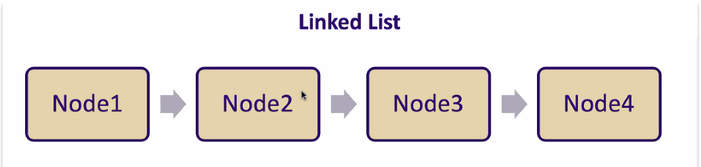
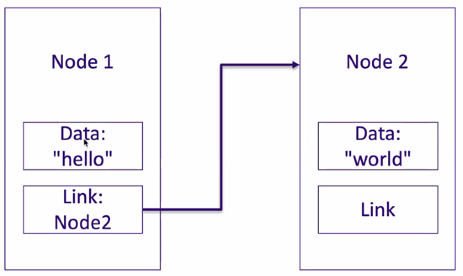
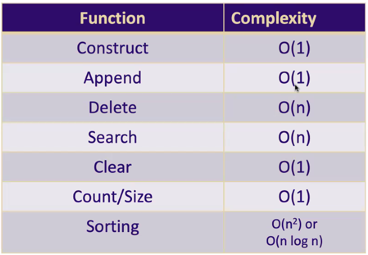

_10/15/22, 9:30a-12:00p_

# TCSS 501: Arrays & Linked Lists


## Data Access Speeds

- L1/L2 Cache - on CPU (nanoseconds)
- Random Access Memory (RAM) (aka memory) (microseconds)
- Hard Disk (SSD>HDD) (milliseconds)
- Local Area Network (LAN)
- Wide Area Network (WAN)

In RAM, every byte of memory has an _address_. When we tell a program to assign a value to a variable `c="Hello`, we are assigning it to an address.

Today's computers have abundant memory. A new MBP 16" can hold 64GB of RAM. But if you're building on a microservice architecture, your container may only be given a few hundred MB.

Treat memory like you do water in your home. Use as much as you need to perform your task, but don't waste it.

_____

## Arrays

Arrays do not have to be single dimensional. Arrays can be n-Dimensional. The are still access in memory but with a different multiplier.

> A 2d+ array is often referred to as a Matrix

### Arrays in RAM

- If no size is given on instantiation, a default/standard size is chosen by the system.
- If more elements are needed than the initial allocation, the array is copied to a new memory location of sufficient size.
- If you do not have enough memory to allocate a contiguous block, you may receive an out of memory (malloc) error.

### Modifying data

If we are changing the value of Index 4 to 1000, `Array[4] = 1000`, under the hood, the system knows the base address so it can be found without iteration in constant time.

But if we are inserting a value between Array[4] and Array[5]. The worst case there is O(n) since the data in indexes 5-9 must be copied and shifted down one. And if you ran out of room, a new array must be initialized elsewhere in mem with a larger contiguous set of memory and all copied over.

**Advantages:**
- Extremely Fast access to read and write
- Extremely fast iteration
- Multi dimensional
- _Extremely simple_

**Disadvantages:**
- Contiguous memory requirement
- Slow inserts
- _Extremely simple_

### In Python
Lots of material describes "Lists" as Python Arrays, but that isn't exactly True. Python doesn't have a primitive Array but it does come with an "array" library that can be used. Warning: Deprecated as of Python 4.0

#### Differences between Python Array vs Python List
**Arrays**
- Single static datatype
- Supports chars not strings
- Small memory footprint
- Single dimensional

**Lists**
- Dynamic datatypes
- Supports strings
- Larger memory footprint
- Can be multi-dimensional

_____
## Numpy Arrays
Widely supported and adopted library
Used for fast numerical calculations
Stores data in grids/matrices
Single datatype (but that datatype can be "object")

**Numpy Arrays**
- single but dynamic datatypes
- large mem footprint
- support strings
- static sizing
- very fast mathematical calc

**Lists**
- dynamic datatypes
- larger mem footprint
- supports strings
- dynamic sizing
- not so good at maths

```python
import numpy as np
# note np is just a common naming convention for aliasing numpy

my_array = np.array([1, 2, 3, 4, 5])

for i in range(0,my_array.size):
  print(f"my_array[{i}] = {my_array[i]}")

my_big_array = np.array(np.linspace(1,100,100))
my_big_array[0:5]
# array([1.,2.,3.,4.,5.])

my_big_array_x_10 = my_big_array * 10
# array([10., 20., 30., 40., 50.])
```

______

## Linked Lists

> Disclaimer, this is not the python native implementation of a "list". This will be the computer science concept.

A data structure consisting of a series of nodes with one or more links between successive nodes. They are said to have an order and each node has a limited knowledge of the other nodes.



### Nodes

Nodes are foundation blocks of **Lists** (and many other data structures).

In its most simple definition a **Node** is a container of data that has possible relationships (or **links**) with one or more other **Nodes**.



**Basic Node Class:**

```python
class BasicNote:

  def __init__(self, data=None)
    self.data = data
    self.link = None

n1 = BasicNode("Hello")
n2 = BasicNode("World")

n1.link = n2

print(f"{n1.data}, {n1.link.data}")
# "Hello, World"
```

If we change data in node 2, we can still get to that new data via n1.

```python
n2.data = "Universe"
print(f"{n1.data}, {n1.link.data}")
# "Hello, Universe"
```

#### Looping through Nodes

You can keep linking and then loop through:

```python
class BasicNote:

  def __init__(self, data=None, link=None)
    self.data = data
    self.link = None

n4 = BasicNode("Moon")
n3 = BasicNode("Goodnight", n4)
n2 = BasicNode("World", n3)
n1 = BasicNode("Hello", n2)

curr = n1
while curr:
  print(f"{curr.data}", end=", ")
  curr = curr.link

print("\b\b")

# Hello, World, Goodnight, Moon
```
Normally, the node structure abstracted into the class of the data structure we are building.

### Singly Linked Lists

The most simple linked list... only one link from one node to the next successive node. The book mixes up "tail" and "head". For lecture, using first and last.

```python
class SingleLinkNode:
  def __init__(self, data=None):
    self.data = data
    self.next = None

class SinglyLinkedList:
  def __init__(self):
    self.first = None
```

#### Append 
Rather than using node.next = node, we will use an append function to add a node to the end of the list. 

One solution is to use `while curr` to iterate until we get to the end of the list. This is O(n). 

We can actually do it in constant time by keeping a pointer to the last node of the list.

```python
class SingleLinkNode:
  def __init__(self, data=None):
    self.data = data
    self.next = None

class SinglyLinkedList:
  def __init__(self):
    self.first = None
    self.last = None

  def append(self, data):
    n = SingleLinkNode(data)

    # Special case for empty lists
    if self.first is None:
      self.first = n
      self.last = n
    else: # Add the node to the end
      self.last.next = n
      self.last = n
```

#### Count
You can loop through and keep a counter, which is O(n). BUT you can just keep another attribute for O(1)!

```python
class SingleLinkNode:
  def __init__(self, data=None):
    self.data = data
    self.next = None

class SinglyLinkedList:
  def __init__(self):
    self.first = None
    self.last = None
    self.count = 0


  def append(self, data):
    n = SingleLinkNode(data)

    # Special case for empty lists
    if self.first is None:
      self.first = n
      self.last = n
    else: # Add the node to the end
      self.last.next = n
      self.last = n

    self.count += 1

  def size(self):
    return self.count
```

#### Iteration
To iterate through the Linked List, we can take advantage of Python's `yield` statement.

`yield` is a special type of `return`. It holds the context and state of the function after returning the value, so the next time the function is called, it will return the next value in the list.

```python
def iter(self)
  curr = self.first
  while curr:
    ret = curr.data
    curr = curr.next
    yield ret

for e in my_linked_list.iter():
  print(e)
```

You can achieve `yield`-like behavior by maintaining a `self.curr` pointer and using a `.next()` function to move and return the pointer.

#### Delete
Removing is not quite as easy as adding a node.

First, how do you identify which node to delete? Based on Index, Data, Memory Address? For example, we'll start with matching the data within the node. If there exists more than one node with the same data, only the first node will be removed.

`my_linked_list.delete("world")`

Once you've found node to delete you have to make sure you're handling all of the pointers correctly. If you're removing the first node, you need to update the pointer of the first, likewise for last. If you're removing from the middle, then you need to set the next pointer of the previous node. Then decrement the count.

```python
def delete(self, data):
  curr = self.first
  prev = self.first

  while curr:
    if curr.data == data: # if we have a match
      if curr == self.first: # delete from fron so update .first
        self.first = curr.next
      else:
        prev.next = curr.next
        if curr == self.last: # if from back, update .last
          self.last = prev
      self.count -= 1

    prev = curr
    curr = curr.next

```

#### Search & Contains

```python
def contains (self, data):
  for n in self.iter();
    if data == n:
      return True
  return False

def search (self, data): # O(n)
  curr = self.first
  while curr:
    if curr.data == data:
      return curr
    curr = curr.next
  return None
```

#### Clearing

```python
def clear(self):
  self.first = None
  self.last = None
  self.count = 0
```

### Complexity Summary for Linked Lists



### Doubly Linked Lists
Behave nearly identically to Singly Linked Lists, with one exception... one may traverse forward AND backward through the list because the nodes have a `.next` and `.prev` link.

Use this majority of time, even if you only need to theoretically traverse forward.

```python
class DoublyLinkNode:
  def __init__(self, data=None):
    self.data = data
    self.next = None
    self.prev = None

class DoublyLinkedList:
  def __init__(self):
    self.first = None
    self.last = None
    self.count = 0

  def append(self, data):
    n = DoublyLinkNode(data)

    if self.first is None:
      self.first = n
      self.last = n
    else: 
      n.prev = self.last
      self.last.next = n
      self.last = n

    self.count += 1

    def delete(self, data):
      curr = self.first
      deleted_fl = False

      if curr is None: # special case for empty lists
        pass
      elif curr.data == data: # special case for remove from front
        self.first = curr.next
        if self.first is not None: # if last el, skip clearing prev link
          self.first.prev = None # clear prev link to new front node
        deleted_fl = True
      elif self.last.data == data: # special case for remove from end
        self.last = self.last.prev
        self.last.next = None
        deleted_fl = True
      else: # regular case, loop through to see if exists in the middle
        while curr:
          if curr.data == data:
            curr.prev.next = curr.next
            curr.next.prev = curr.prev
            deleted_fl = True
          curr = curr.next
      
      if deleted_fl:
        self.count -= 1
      
      return deleted_fl
```

### Circular Lists
Specific class of LL characterized by a lack of a terminus. That is, the last node has a .next that points back to the first node.

Can be unidirection or bidirectional.

The behavior is v similar for adds, but for iter, delete, and search, you can't use while curr since there is never an end to the list.

Good for control mechinisms (like lists of seasons)