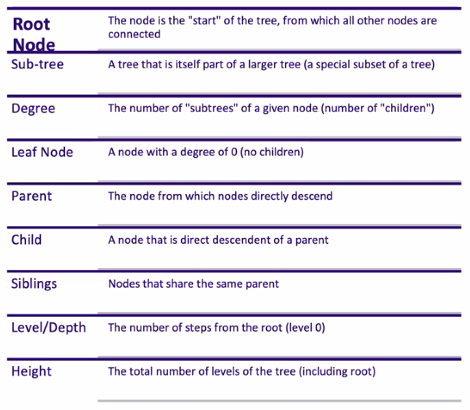

_10/28/22, 9:30a-12:00p_

# TCSS 501: Graphs and Trees


## Graphs

A mathematical structure that consists of **Nodes** (Vertices) and **Edges** (Links, Relationships). Can be used to model countless problems: Social Networks, Roadways, Waterflows, Electrical Circuits, Rocket Engines.


Some Quirks:

- A Node does not require any connected Edges
- An Edge is REQUIRED to connect to a Node at BOTH ends
- An Edge can connect to the SAME Node at BOTH ends


Nodes have a particular **Degree** value associate to it. Degree is the number of Edges linked to the Node. The SUM of the Degree will always be 2x the number of Edges

More Vocabulary:

- If two Edges connect the same two nodes, they are considered **parallel** edges.
- An Edge directly connecting a node to itself is known as **Self-Loop**
- A graph without Self-Loops or parallel edges is a **Simple Graph**


### Directional and Undirected Graphs

A graph is **Directional (digraph)** when the edges are given the additional attribute of a direction. This means that the edge can only be traversed in a single direction.

An **Undirected** graph's edges are bi-directional and you can traverse both directions. 

Directed Graphs consider degrees differently. There is a distinction between the degree of **inbound edges** and the degree of **outbound edges**.


### Paths

A **Path** is a sequence (finite or infinite) of EDGES that join a sequence of (unique<sup>*</sup>) NODES.

We say a path exists between two nodes when we can traverse between them.

_<sup>*</sup> Note: Paths have two defs in literature. Most often the nodes must be unique along the path. You can find some def that allow for the same node to be visited more than once._

For this course, we will use the infinite/non-unique version.


### Cycles

A **Cycle** is a path that starts and ends at the same node. Can also be referred to as **Circuits**.

Need to be mindful of cycles especially when traversing, because this can cause infinite links.


### Traversal: Depth First vs Breadth First

Same time complexity: O(V + E)
Recursive in Nature (doesn't require recursion)

#### Breadth First

Implemented with a Queue (FIFO). Traverse across nodes one layer at a time

#### Depth First
Traverse deep down each path, implemented using Stacks (LIFO).


_____
## Trees

A special form of Graph. Undirected such that there is _exactly one path_ between any two vertices.

Trees in computer science are also **Rooted Trees** (a tree with a special node called/labeled the "root" node)

Though mathematically "undirected", we think of trees as having a parent-child relationship between nodes when implemented as a data structure.

### Tree Vocabulary




### Binary Trees

A tree with each node has a maximum of degree 2 (that is no more than 2 children). A **complete** tree where every node except the leaves have two children. 

#### Binary Search Trees

A binary tree organized in such a way that binary search can be executed simply and effectively. Everything smaller to the left, everything bigger to the right.

> You can search for 2<sup>n</sup> objects in a sorted list in n hops.

Method: cut the search space in half at each step.

Example: I'm thinking of a number between 1 and 1024 (2<sup>10</sup>)...

You can guess in only 10 guesses!!
1. Search Space: 1024 | guess middle (512) - higher,
2. Search Space: 512 | guess middle again (768) - lower
3. Search Space: 256 | guess middle again... on and on

```python
class BinarySearchTree:
  def __init__(self):
    self.root_node = None

  def is_empty(self):
    return self.root_node == None

  def insert(self, data):
    n = GraphNode(data)
    if self.is_empty():
      self.root_node = n
    else:
      curr = self.root_node
      parent = None

      while True:
        parent = curr

        if n.data = curr.data:
          curr = curr.left
          if not curr:
            parent.left = n
            return
        else:
          curr = curr.right
          if not curr:
            parent.right = n
            return

  def search(self, data):
    curr = self.root_node

    while True:
      if not curr:
        return None
      elif curr.data == data:
        return data
      elif curr.data > data:
        curr = curr.left
      else:
        curr = curr.right  
```

To keep a O(log n) performance on Search in a binary tree, you must keep the tree balanced. Do so by maintaining balance on insert (we will learn how to do this later). You check the balance by comparing the heights of the left and right sides. This can be done recursively

```python
def get_height(self):
  return self.__get_height__(self.root_node)

def __get_height__(self, node):
  if node is None:
    return 0
  else:
    l = self.__get_height__(node.left)
    r = self.__get_height__(node.right)

    return max(l, r) + 1

def is_balanced(self):
  if self.root_node is None:
    return True
  lh = self.__get_height__(self.root_node.left)
  rh = self.__get_height__(self.root_node.right)
  return abs(lh - rh) < 2
```

Deleting has 3 cases:
- no children
  - simply delete node
- one child
  - set the child's parent as the deleted node's parent
- two children
  - determine which is the new parent of the other. 
  - One way: Find the smallest node in the tree that is larger than the node we are deleting. That is a right traversal followed by left all the way down. Replace the deleted node in the structure with the found node and replace the parent and child nodes.
  - Better way: Traverse to the right then left as far as you can go, then take the data from the furthest left node and copy it inot the node you're "deleting". Set the left most nodes parents left to it's right node

```python
def get_node_with_parent(self, data):
  """
  A helper function because we aren't tracking the node's parent as we add them. 
  This is something we should do in practice, but it's also good practice to write these little helper functions.
  """
  parent = None
  curr = self.root_node
  while curr:
    if curr.data == data:
      return parent, curr
    elif curr.data < data:
      parent = curr
      curr = curr.left
    else:
      parent = curr
      curr = curr.right
  return parent, curr

def remove(self, data):
  parent, node = self.get_node_with_parent(data)

  if node is None:
    return False

  children = 0
  if node.left and node.right:
    children = 2
  elif node.left or node.right:
    children = 1
  
  # --- NO CHILDREN ---
  if children == 0:
    if parent:
      if parent.right is node:
        parent.right = None
      else:
        parent.left = None
    else: 
      self.root_node = None
  
  # --- ONE CHILD ---
  elif children == 1:
    next_n = None
    if node.left:
      next_n = node.left
    else:
      next_n = node.right

    if parent:
      if parent.left is node:
        parent.left = next_n
      else:
        parent.right = next_n
    else:
      self.root_node = next_n

  # --- TWO CHILDREN ---
  else:
    left_parent = node
    leftmost_node = node.right

    while leftmost_node.left:
      left_parent = leftmost_node
      leftmost_node = leftmost_node.left

    node.data = leftmost_node.data

    if left_parent.left == leftmost_node:
      left_parent.left = leftmost_node.right
    else:
      left_parent.right = leftmost_node.right
```