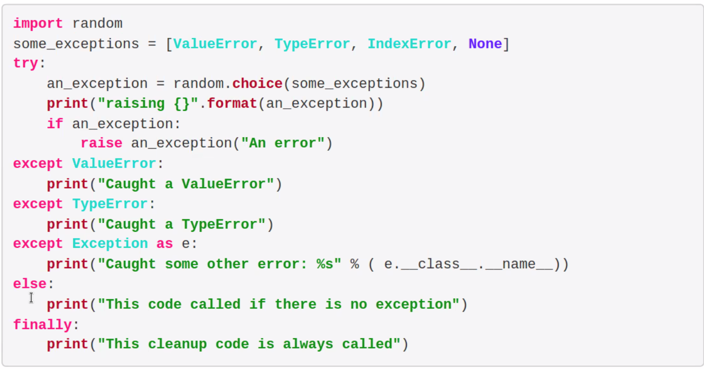
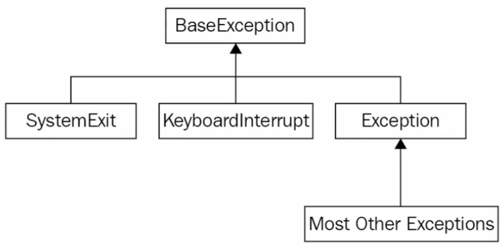

_10/15/22, 1:30p-4:00p_

# TCSS 502: Exceptions

______
## Exceptions
When an exception is raise, it appears to stop program excution immediately.

If we encounter an exception, how should our code react to or recover from it?

Wrap it!

```python
def no_return():
  print("I am about to raise an exception")
  raise Exception("This is always raised")

try:
  no_return()
except:
  print("I caught an exception")
print("executed after the exception")
```

What if we were writing some code that could raise both TypeError and ZeroDivisionError

```python
def funny_division(divider):
  try:
    return 100/divider
  except ZeroDivisionError:
    return "Zero is not a good idea!"

print(funny_division(0)) # Zero is not a good idea
print(funny_division(50.0)) # 2.0
print(funny_division("hello")) # TypeError
```
Can do more than one:

```python
def funny_division(divider):
  try:
    if divider == 13:
      raise ValueError("13 is unlucky")
    return 100/divider
  except (ZeroDivisionError, TypeError):
    return "Enter a number other than 0"
```
syntax uses a `as` keyword:

```python
try:
  raise ValueError("This is an argument")
except ValueError as e:
  print("The Exception args were", e.args)
```

How execute whether or not exception has occurred?


### Exception Hierarchy
Most Exceptions are subclasses of `Exception` class
- `SystemExit`: when the user selected an exit menu item, click the close button on a wind or entered a command to shut down a server
- `KeyboardInterrupt`: when the user explicitly interrupts program execution (ctrl + C)



### Define our own
Just inherit from the Exception class.
```python
class InvalidWithdrawal(Exception):
  pass

raise InvalidWithdrawal("You do not have $50 in your account")
```

An example of an exception to accept 
```python
class InvalidWithdrawal(Exception):
  def __init__(self, balance, amount):
    super().__init__(f"account does not have ${amount}")
    self.amount = amount
    self.balance = balance

  def overage(self):
    return self.amount - self.balance

raise InvalidWithdrawal(25, 50)


try:
  raise InvalidWithdrawal(25, 50)
except InvalidWithdrawal as e:
  print(f"I am sorry but your withdrawal is more than your balance by ${e.overage()}")
```

## Objects
Data, properties, and methods are all attributes on a class.
Methods are just callable attributes
Properties are just customizable attributes
Need to decide between standard data attributes and properties
We can invoke custom actions automatically when a property is retrieved, not like an attribute
Custom setters are useful for validation

## Duplicate Code

Keeping two similar pieces of code up to date can be a nightmare

Do not copy and past in the code (Don't Repeat Yourself - DRY)

## Regular Functions vs Generators

generators are easy to implement, memory efficient, represent infinite stream, pipelining generators

```python
# REGULAR
def my_function():
  return 1


test = my_function()
print(test) # 1

# -------------------

# GENERATOR
def my_function():
  yield 1


test = my_function()
print(test) # <generator object my_function at [...]>
```

```python
def my_function():
  yield 1
  yield 2
  yield 3


test = my_function()
print(test) # <generator object my_function at [...]>
print(next(test)) # 1
print(next(test)) # 2
print(next(test)) # 3
```

```python
def my_function():
  yield 1
  yield 2
  yield 3

for item in my_function()
  print(item)

# 1
# 2
# 3
```

```python
class counter:
  def __init__(self, max = 0):
    self.value = 0
    self.max = max

  def __iter__(self):
    return self
  
  def __next__(self):
    if self.value > self.max:
      raise StopIteration

    value = self.value
    self.value +=1
    return value


for item in counter(20):
  print(item)
```
Generators are easy way to make an iterator
```python
def counter(max=0):
  value = 0
  while value <= max:
    yield value
    value += 1

for item in counter(20):
  print(item)
```

## Comprehensions

simple but powerful
transform or filter an iterable object in as little as one line of code
type
- list
- set
- dictionary
- generator


*the `for` on the last line of commone operators is supposed to be `append`