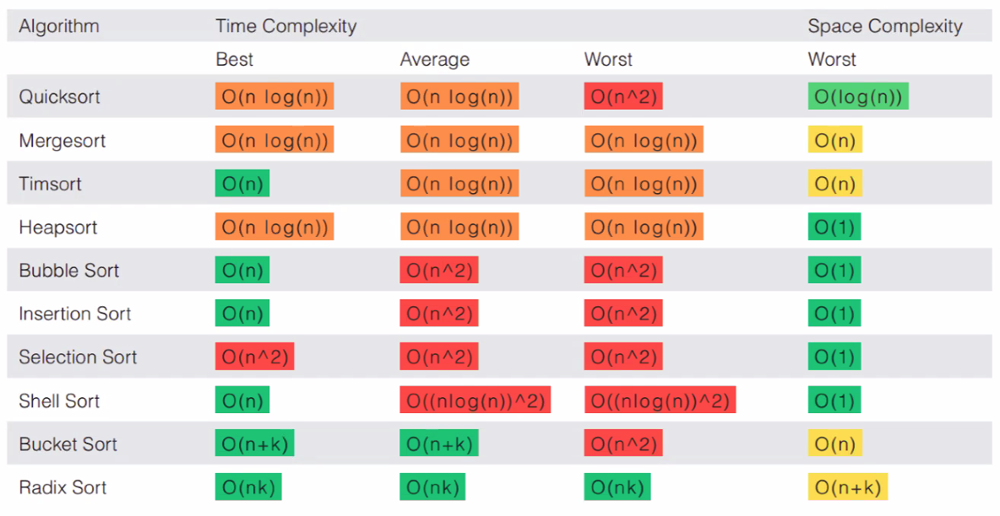

_10/28/22, 1:30p-4:00p_

# TCSS 502: Sorting

## Sorting

**[SLIDES FOR SORTING](https://drive.google.com/drive/u/0/folders/1aHhezqxhXRikw26cKDxI3NxQ_Mnp-x3h)**

There are many sorting algorithms:

- **Bubble Sort** | swap adjacent pairs that are out of order
- **Selection Sort** | look for smallest el, move to front
- **Insertion Sort** | build an increasingly large sorted front portion
- **Quick Sort** | recursively partition array based on a middle value
- **Merge Sort** | recursively divide the array in half and sort it
- **Bogo Sort** | Randomly check pairs, shuffle and pray
- **Heap Sort** | place values into a sorted tree structrue
- **Bucket Sort** | cluster el into smaller groups, sort them
- **Radix Sort** | sort int by last digit, then 2nd to last, and on

Take into account:

- Memory Usage (RAM)
- Complexity (Time and Space)
- Approach (Iteration & Recursion)

### Bubble Sort

Checking and swapping adjacent pairs that are out of order, moving down the list. Continuing to iterate until everything is in order and nothing swaps.

At the end of the first iteration, the right most value should be the biggest one, then after the second, then the second to the right most will be in the right position, and so on.

The main idea is to push the maxium value to the end of the array for each iteration.

The original implementation was to repeat N iterations which N is the number of el in the array.

### Selection Sort

Mark the current el, find the minium value of the rest, compare the current el and the min value of the rest of the list, and swap them if they are not in order. Then mark the next current el and repeat.

Main idea is to compare the curr el with the minimum and push the min to the left of the array.

repeat n iteration which N is the number of el in the array

### Insertion Sort

Comparing the curr el with the sorted list.

Main idea is to compare the curr el wit the sorted area on the left side of the array and place the curr el in approp location to maintain the area sorted

Implementation to maintain a sorted area for every single el in the array

The curr el compares with each el in the sorted area from the right (compare )

N2 but can be done in N log N if using binary search

### Quick Sort

Pick a pivot at the end, then pick the left most el as curr el. If the curr el is greater than the pivot, the mark it. Then pick the right most el as the curr el. The curr el is greater than the pivot, then pass it and move to the next el. If the curr el is smaller than the pivot, then mark it. Then swap the two marked el. Then pick the next left most el as curr el...

Main idea to split array into two partitions and recursively apply alg on those two partitions

Implementation maintain two partitions that one partition has elements smaller than the pivot and other has el greater than the pivot

Optimization is to choose a random pivot that can min the chance you will encounter worst case performatnc, quadratice.

Choosing first or last could cause worst cas for a nearly sorted array

### Merge Sort

Split array into halves continuously until you have indiviual el to compare. Then sort those. To merge, compare each el in each part. Put the smaller el into the new array, then move to the next el to compare.

Main idea is to split array into two partictions with the same portion (off by one if odd number of el)

Implementation is to rea

### Complexity of Sorting

_____
## Python Design Patterns

### Decorator Pattern
Allows us to wrap an object. Provides core functionality. Interact with other object same way.

Has two primaty uses:
- enhance the response of a component and send data to another component
- support multiple optional behaviors

Maintain a reference to another instance
