_10/01/22, 1:30p-4:00p_

# TCSS 502

## Resources
- Python 3 API documentation: https://docs.python.org/3/contents.html
- Excellent Beginning Python Tutorial (broken into sections that you can click to view): [Learn Python - Full Course for Beginners](https://www.youtube.com/watch?v=rfscVS0vtbw&ab_channel=freeCodeCamp.org)
- Official Python Naming Conventions: https://realpython.com/python-pep8/
- Nice online tutorial by topic: https://www.w3schools.com/python/default.asp

----
## Python Basics

**`print()` Statements**

Takes a input parameter and writes it to the console

Adding `end=''` at the end of your `print()` statements allows you to print without moving to the next line. Allows you to print partial messages on the same line.

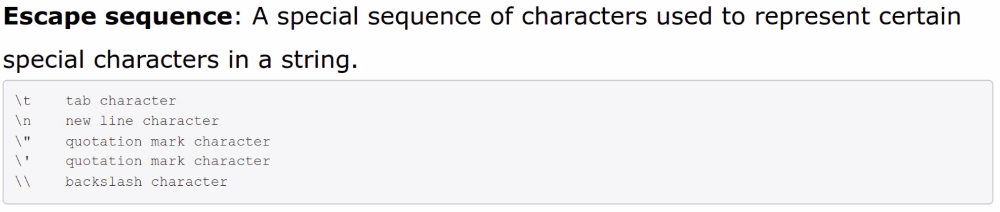

**Function Syntax**
```python
def name(parameter):
  <statement>(s)
```

**Arithmatic Operators**
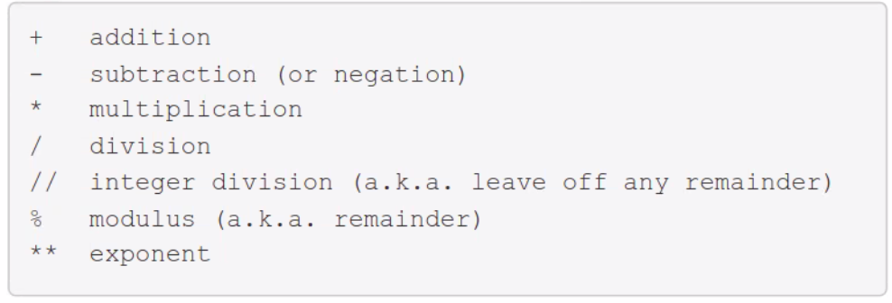


**`for` Loops**
```python
for variable in range (start, stop, step):    # Step parameter is optional
  statement
```

If variable is less than the stop. If not, stop.

Change Step Size:
```python
for i in range(10, 0, -1):      # Changes step to -1. Default is 1
  statement
```

**Constant Variables**

Constant variables are usually indicated as ALL_UPPER_CASE. Assigment works the same as normal variable assignment. Should be set only at declaration and shouldn't be reassigned.

**`Random`**

Generates pseudo-random numbers. Need to `import random` package

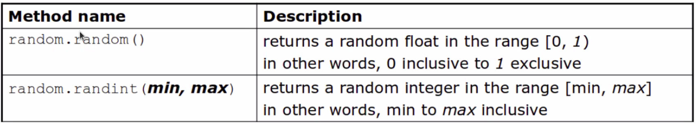


**`if` Statements**

```python
if <test>:
  <statement>
elif <test>:
  <statement>
else:
  <statement>
```

`if` statements use logical tests via relational expressions


If the statements end with an `else`, exactly one path must be taken. If it ends with `if`, the code might not execute any path. 

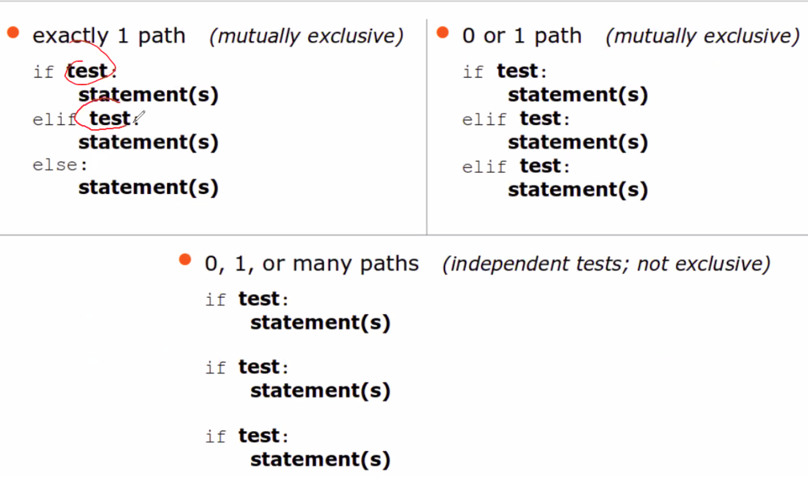

**Strings & Indexes**

Characters of a string are numbered with 0-based indexes.
- First character's index: 0
- Last character's index: 1 less than the string's length

To access substring:
```python
part = string[start:stop] # start is inclusive, stop is exclusive

# Example:
s = "Merlin"
mid = s[1,3] # "er"
```

String methods are called using dot notation. Ex: `print(string.lower())`

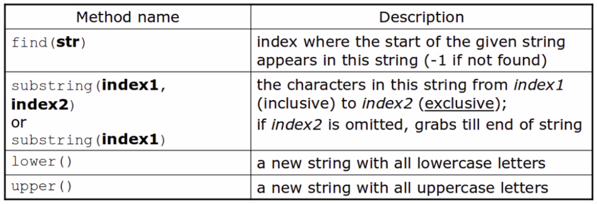

**`while` Loop**

Repeatedly executes its body as long as a logical test is true

```python
while <test>:
  <statement>
```

**File Input/Output (I/O)**

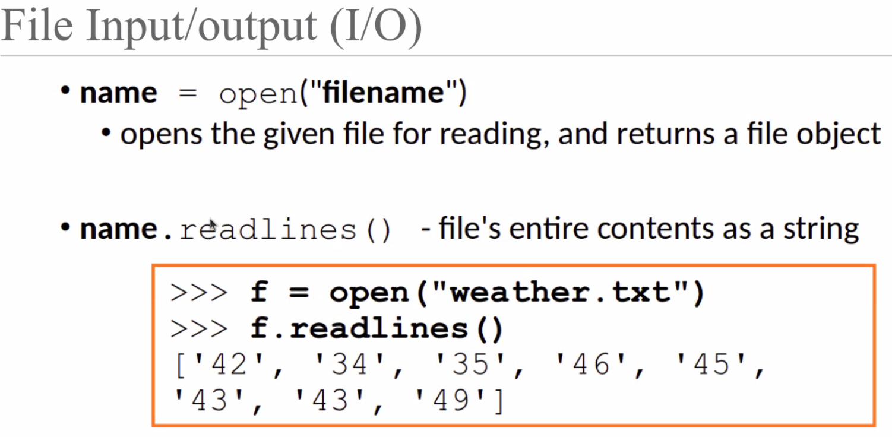

```python
# Better Style

with open("weather.txt") as file:
  file.readlines()
```

Open a file in write or append mode
- `w` - write mode - replaces everything in file
- `a` - append mode - adds to the bottom of the file preserving what is already in it

```python
name = open("filename", "w") # write mode
name = open("filename", "a") # append mode

name.write(str) # writes the given string to the file
name.close() # closes file once writing is done
```

**List**

Object that stoes many values. _element_ is a value in a list, and _index_ is a 0-based integer to access an element from a list.

```python
name = [value, value, value]

# if you have a list times an integer, it will expand the size of the list
# name = [value] * count
numbers = [0] * 4 # [0, 0, 0, 0]
```

List Functions:

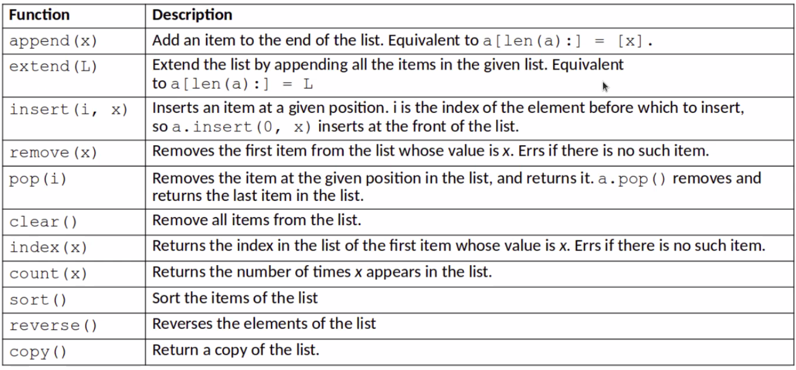

**Tuples**

Similar to a list, but cannot be altered. Good for storing related data.
- store the same type of data in a list
- store related things in tuples

```python
name = (data, other_data, ...)

#ex:
tuple = ("Tuscon", 80, 90)
low = tuple[1]
# is 80
```

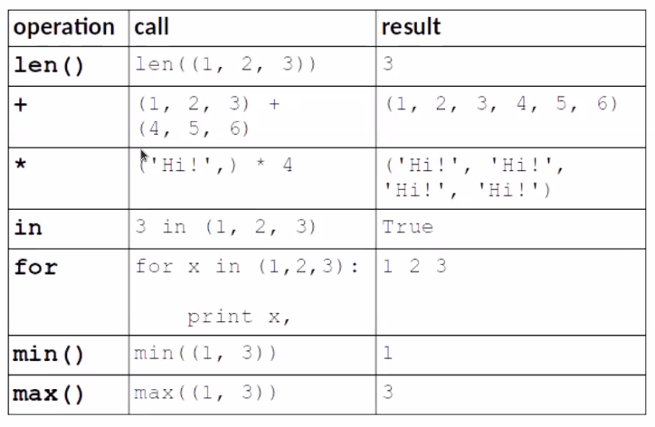

**Sets**

A collection of unique values (no duplicates allowed) that can perform the following operations efficiently:
- add, remove, search (contains)

An empty set: `a = set()`

A set with elements: `b = {"the", "hello", "happy"}`

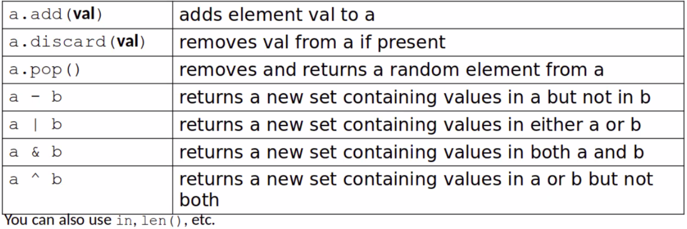

**Dictionaries**

Holds a set of unique keys and a collection of values, where each key is associated with on value.
- aka map, associative array, hash

```python 
my_dict = {key : value, ..., key : value}

#assign
my_dict[key] = value

#access
my_dict[key]
```

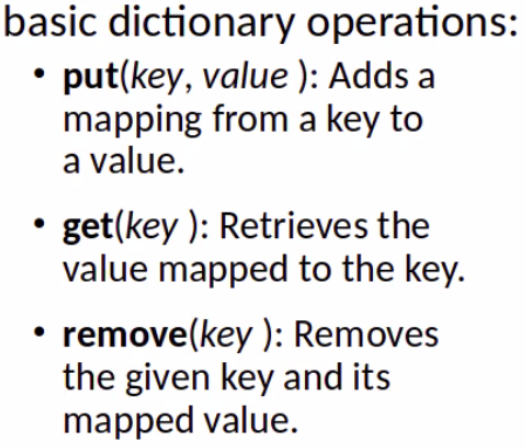

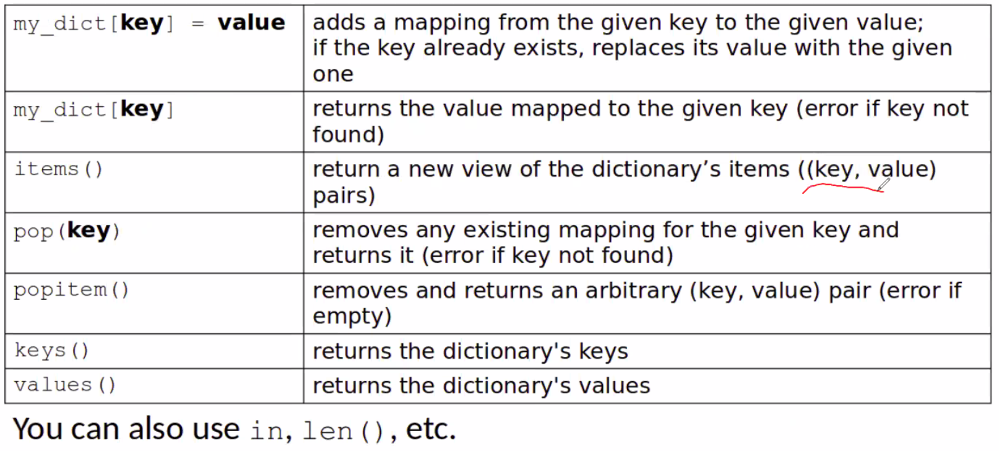

****


### Python's Math Class

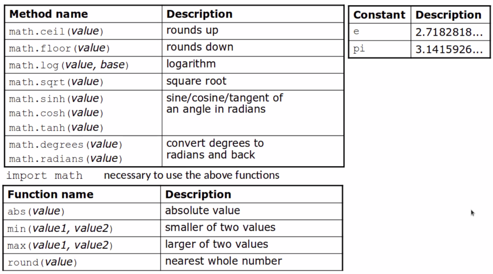


----
## Object Oriented Programming