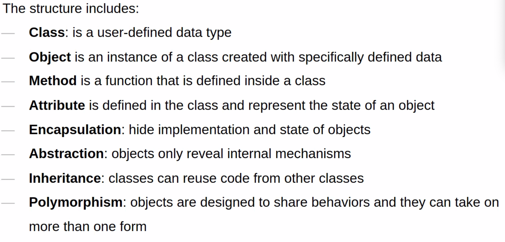

_10/08/22, 1:30p-4:00p_

# TCSS 502: Object Oriented

Object is a collection of data and associated behaviors

Stages:
  - analysis
  - design
  - programming

## Object Oriented Analysis (OOA)

Initial Stages of analysis include:
- interviewing customrer
- studying their processes
- eliminating possibilities

Turn tasks into requirements

The analysis stage is all about what needs to be done

## Object Oriented Design (OOD)

Convert requirements to implementation specification
Name the objects
define the behaviors


## Object Oriented Programming
Create objects and function based on the design



## Objects and Classes

- a class is a blueprint for creating and object
- an object is a collection of data with associated behaviors
- classes describe objects

### Unified Modeling Language (UML)

- an orange is associated with a basked
- an apple is associated with a barrel
- many oranges go in one basket use asterisk (*)
- many apples go in one barrel 

Data describes objects
- data represents the individual characteristics of a certain object
- attributes are frequently referred to as members or properties
  - attributes don't have to be unique
- some properties may also belong to multiple classes

A parameter is an object that passed into a method through definition
A argument is an object that passed into a method during invocation

### Encapsulation
A process of hiding the implementation of an object

The interface is the collection of attrbutes and methods that other objects can access

Abstraction is another object oriented term related to encapsulation and information hiding

### Copmosition & Aggregation
Composition is to collect several objects together to create a new one.
- Composition is usually a good choice when one object is a part of another
  - ex. A is a part of B, so if B is destroyed, A is also destroyed
Aggregation is almost exactly like composition but can exist independently.

### Inheritance
The is a relationship is formed by inheritance

_____
#### Class Exercise #1
Design a UML class diagram that describe
- The Point has x and y coordinates
- We can draw a Shape and calculate its perimeter and area
- The Rectangle is a shape that has two points (Point): one at the top left corner and another one is at the bottom right corner
- The Triangle has three points (Point) to form a Shape. We have two special triangles called RightTriangle and EquivalentTriangle
- The Circle has a center Point and an integer radius

[Our Solution](../img/ClassUMLExercise.drawio.png)
_____

### OO Class

```python
class Point:
  pass # means do nothing

p1 = Point()
p2 = Point()

p1.x = 5
```

Indentation (four spaces) is used to delimit the classes

```python
class Point:
  def reset(self)
    self.x = 0
    self.y = 0

p = Point()
p.x = 4
p.y = 7
p.reset()
print(p.x, p.y) # prints 0 0
```

```python
import Math

class Point:
  def move(self, x, y):
    self.x = x
    self.y = y

  def reset(self):
    self.move(0, 0)
```

```python
class Point:
  def __init__(self, x, y): # constructor
    self.move(x, y)

  def move(self, x, y):
    self.x = x
    self.y = y

  def reset(self):
    self.move(0, 0)


p1 = Point(2, 5)
print(p1.x, p1.y) # 2 5

p2 = Point()
print(p2.x, p2.y) # Error
```

```python
class Point:
  def __init__(self, x = 0, y = 0): # constructor with default arguments
    self.move(x, y)

  def move(self, x, y):
    self.x = x
    self.y = y

  def reset(self):
    self.move(0, 0)


p1 = Point(2, 5)
print(p1.x, p1.y) # 2 5

p2 = Point()
print(p2.x, p2.y) # 0 0
```

### Explaining Yourself
Write API documentation that clearly summarizes what each object and method does.

#### Docstrings
In the terminal, `Q` to go back

### Modules and Packages
Import with `import`

Any class/function in the module can be accessed using the module dot notation
`import point.Point`

We can import one class using `from ... import` with or without alias
`from point import Point` | `from point import Point as P`

A **Package** is a collection of modules in a folder
- the name of the package is the name of the folder.

There are two ways of importing modules
  1. Absolute
  2. Relative

Absolute from current dir `from point import Point`
Relative from current dir `from .point import Point`
Relative from parent dir `from ..point import Point`

### Access
Can use name mangling __ to provide a surface level of protection and designate something as private. Any access to these items must be provided by accessor/mutator (getter/setter) methods. 

_____
#### Class Activity #2
Design a Vehicle class that describe:
- The name of the vehicle
- The max speed of the vehicle that can reach
- The mileage of the vehicle

Design functions in the Vehicle class to calculate: (assume the vehicle has constant speed at 80mph and no police on the road)
- How far does the vehicle go in a given time (in hour)?
- How long does it take the vehicle to reach a destination with given distance (in mile)?


Our Solution:
```python
class Vehicle:
    def __init__(self, name, max_speed, mileage):
        self.set(name, max_speed, mileage)

    def set(self, name, max_speed, mileage):
        self.name = name
        self.max_speed = max_speed
        self.mileage = mileage

    def calculate_travel_distance(self, hours):
        return self.max_speed * hours

    def calculate_travel_time(self, miles):
        return miles / self.max_speed


myCar = Vehicle('Sally', 120, 23)

print(myCar.calculate_travel_distance(1))

print(myCar.calculate_travel_time(936))
```
_____

### Objectives

Every class we create uses inheritance.

A class inherits from object if we don't explicitly inherit from a different class
- a superclass (parent) 
- a subclass (child)

```python
class Contact:
  all_contacts = []
  ...
```

What if contacts are also suppliers?

```python
class Supplier(Contact):
  ...
```

What if wanted to search that list by name?
```python
class ContactList(list)
  def search(self, name):
    matching_contacts = []
    for contact in self:
        if name in contact.name:
          matching_contacts.append(contact)
    return matching_contacts


class Contact:
  all_contacts = []
  
  def __init__(self, name, email):
    self.name = name
    self.email = email
```

### Built-Ins

Declare a **list**:

```python
my_list = list()
my_list = []
my_list = [1, 2, 3, 4]
my_list = ["hello", "world"]
```

Declare a **dictionary**:

```python
my_dict = dict()
my_dict = {}
my_dict = { "a": 3, "b": 7 }
```

### Overriding and Super

Change the behavior of inherited methods by rewriting.

```python
class Friend(Contact)
  def __init__(self, name, email, phone):
    self.name = name
    self.email = email
    self.phone = phone
```

Make it DRY! We already have name and email from the parent class. `super()` returns the object as an instance of the parent class.

```python
class Friend(Contact)
  def __init__(self, name, email, phone):
    super().__init__(name, email)
    self.phone = phone
```

Form of multiple inheritance is a mixin

```python
class MailSender:
  def send_mail(self, message):
    print("Sending mail to " + self.email)
    ... #smtplib for email logic

class EmailableContact(Contact, MailSender):
  pass
```

### The Diamond Problem
```python
class Friend(Contact, AddressHolder)
  def __init__(self, name, email, phone, street, city, state, code):
    Contact.__init__(name, email)
    ...
```

Polymorphism describes different behaviors happen depending on which subclass is being used.

Duck Typing makes this less useful