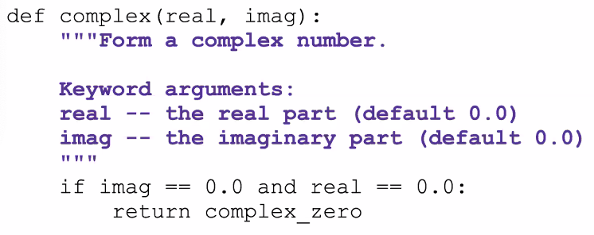

_09/24/22, 1:00p-3:00p_

# Debugging and Principles of Good Programming

## Debugger

IDE's have a debugger tool that allows you to step through an application line by line. 

First have to set a _breakpoint_ by clicking in the gutter of the IDE.

## Good Programming

Avoid putting conditions in variable names. For example:
- A variable called "not_logged_in" could simply be "logged_in"

If you have an if statement like "if x == true" you don't need to include == true

Organize all code into functions

Utilize comments! Use the # character for single line comments

Triple """ can be for multiline comments, and another set of """ to end the comment

DocStrings!

PyCharm has an auto reformat! Code > Reformat Code

Refactoring