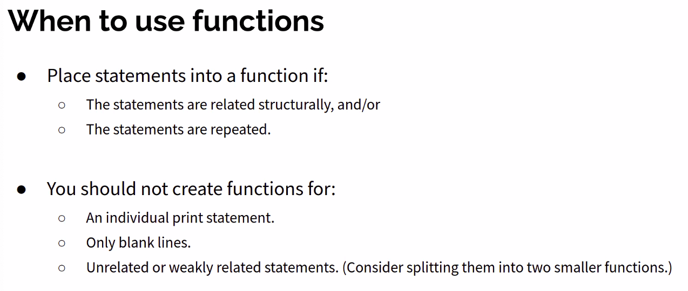

_09/24/22, 10:00a-12:00p_

# Advanced Python and Object Oriented Programming

## Review of Module 1
### Conditional Syntax (If Else)

```python
if x > 0:
  print()
else:
  if x < 0:
    print()
  else:
    print()

# is the same as

if x>0:
  print()
elif x<0:
  print()
else:
  print()
```

#### Activity: If Else & Inputs

Write code to output grade letter based on the score input from user.
- Print A if the score is greater than or equal to 98
- Print B if the score is greater than or equal to 90
- Print C if the score is greater than or equal to 75
- Print D if the score is greater than or equal to 60
- Otherwise, print F

```python
data = input('What is your score?')
score = int(data)

if score >= 98:
    print('A')
elif score >= 90:
    print('B')
elif score >= 75:
    print('C')
elif score >= 60:
    print('D')
else:
    print('F')
```

> NOTE: This function only works for whole numbers. To use decimal numbers, you would need to use the `float()` function instead of `int()`.

### For Loop Syntax

#### Activity: 

Write code to output these two figures using nested for loops:
```
# Width = 10 and Height = 5
+/\/\/\/\/\/\/\/\/\/\+
|                    |
|                    |
|                    |
|                    |
|                    |
+/\/\/\/\/\/\/\/\/\/\+


# Width = 4 and Height = 2
+/\/\/\/\+
|        |
|        |
+/\/\/\/\+
```

My Solution:
```python
height = 5
width = 10

# height = 2
# width = 4

for i in range(int(width+2)):
    if i == 0:
        print("+", sep="", end="")
    elif i == width + 1:
        print("+", sep="")
    else:
        print("/", "\\", sep="", end="")

for i in range(height):
    print("|", " " * (width*2), "|", sep="")

for i in range(int(width+2)):
    if i == 0:
        print("+", sep="", end="")
    elif i == width + 1:
        print("+", sep="")
    else:
        print("/", "\\", sep="", end="")
```
Varik's Solution:
```python
width = 10
height = 5

string_builder = "+"

for i in range(width):
    string_builder += "/\\"
string_builder += "+\n"

for i in range(height):
    string_builder += "|"
    for i in range(width):
        string_builder += "  "
    string_builder += "|\n"

string_builder += "+"

for i in range(width):
    string_builder += "/\\"
string_builder += "+\n"

print(string_builder)
```

## Functions

**Algorithm:** A list of steps for solving a problem

Example algorithm: "Bake sugar cookies"
- mix the dry ingredients
- cream the butter and sugar
- ...


problems: lack of structure, many steps tough to follow
redundancy: consider making a double batch

**Function:** a named group of statements that denotes the structure of a program and eliminates redundancy by code reuse

**Procedural Decomposition:** dividing a problem into functions

Syntax:
```python
# declare the function
def name():
  statement
  statement
  # ... and on and on

# call the function
name()
```

### Using functions

1. Design the algorithm
  - look at structure and which commands are repeated
  - decide what are the important overall tasks
2. Declare the functions
  - arrange statements into groups
3. Call the function



### Parameters

A value passed to a function by its caller.

```python
def function_name(parameter_name):
  statement
``` 

When the function is called...
- the value is stored into the parameter variable
- the function's code executes using that value

### Common Errors
- If a function accepts a parameter, it is illegal to call it without passing any value for that parameter.
- The value passed to a function must be of a type that will work.

### Return

To send out a value as the result of a function
- return values send information out from a function to its caller
- a call to the function can be used as part of an expression

```python
def name(parameters):
  statements
  ...
  return expression
```

### Tuples
a sequence similar to a list, but cannot be altered

good for storing related data
- store the same type of data in a list
- store related things in tuples

```python
name = (data, other_data, ...)

#ex:
tuple = ("Tuscon", 80, 90)
low = tuple[1]
# is 80
```

> Cannot update a tuple! They are immutable.

You can loop through, just like a list. 

Operations:


### Activity: Functions 

Write a program to print these figures using functions
- must have at least 2 functions
- the main program must call those 2 functions at least once

```
  ------
 /      \
/        \
\        /
 \      /
  ------
\        /
 \      /
  ------
+--------+

  ------
 /      \
/        \
|  STOP  |
\        /
 \      /
  ------

  ------
 /      \
/        \
+--------+
```

Tips:
- create an empty program
- copy the expected output into it, surrounding each line with print syntax
- run to verify the output
- identify the structure of the output
- divide the code into functions based on the structure
- identify redundancy in the output, create functions to eliminate as mush as possible
- add comments


My solution:
```python
def top_hex():
    print("  ------")
    print(" /      \\")
    print("/        \\")


def bottom_hex():
    print("\\        /")
    print(" \\      /")
    print("  ------")


def sep_line():
    print("+--------+")


def main():
    top_hex()
    bottom_hex()
    bottom_hex()
    sep_line()

    print()

    top_hex()
    print("|  STOP  |")
    bottom_hex()

    print()

    top_hex()
    sep_line()


main()
```

### Activity 2:

In physics, the displacement of a moving body represents its change in position over time while accelerating.

Given initial velocity v<sub>0</sub> in m/s, accleration in a m/s<sup>2</sup>, and elapsed time t in s, the displacement of the body is: displacement = v<sub>0</sub>t + 1/2at<sup>2</sup>

Write a method displacement that accepts v<sub>0</sub>, a, and t and computes and returns the change in position.
- ex: displacement(3.0, 4.0, 5.0) returns 65.0

My Solution:
```python
def displacement(init_v, a, t):
    return (init_v * t) + (0.5 * a * (t * t))


print(displacement(3.0, 4.0, 5.0))

# prints 65.0
```